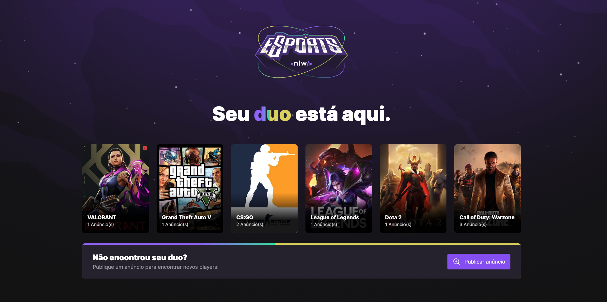
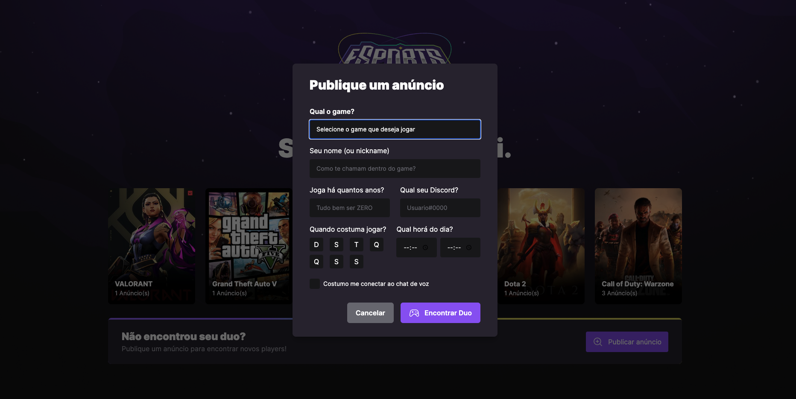
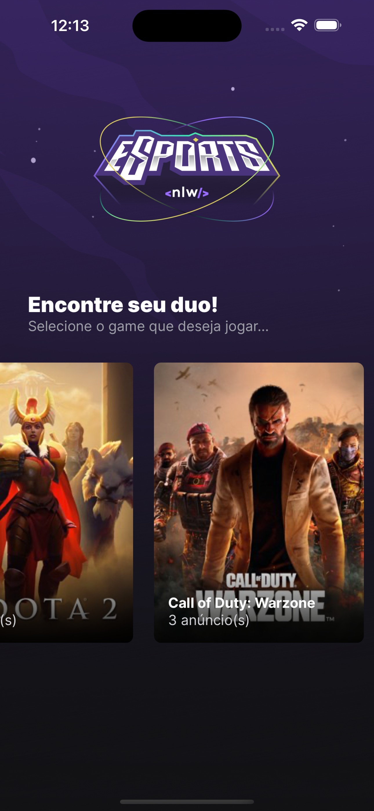
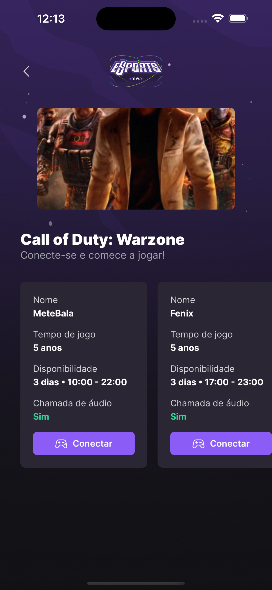
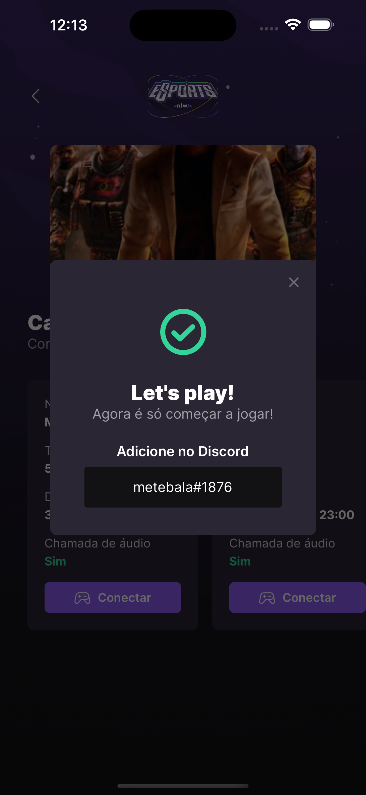
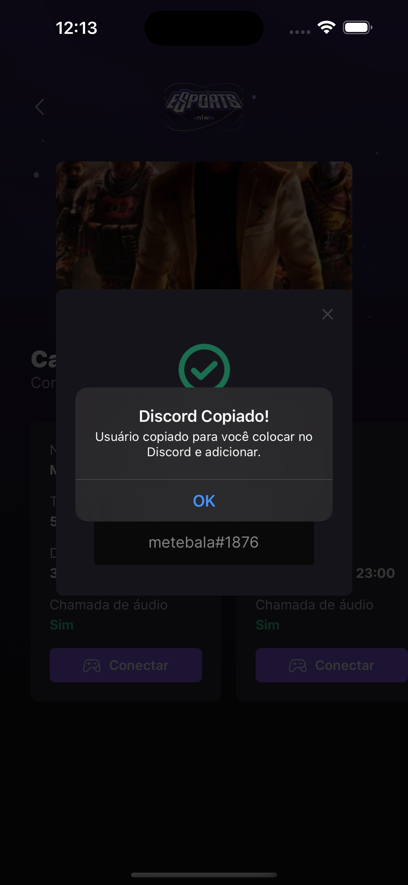

  <h1>Esports Duo</h1>
  

### About project
Esports Duo is a project where online game players create in-game ads to connect with other gamers and play together.

### See all repositories
See the details on how to run this project in each of your repositories, you need to start from the server and then run the web or mobile version as you prefer.
- [Server (API)](https://github.com/jefferson1104/esports-duo/tree/main/server)
- [Front-end (WEB)](https://github.com/jefferson1104/esports-duo/tree/main/web)
- [Mobile](https://github.com/jefferson1104/esports-duo/tree/main/mobile)

### Screenshots

  
  
  
  

