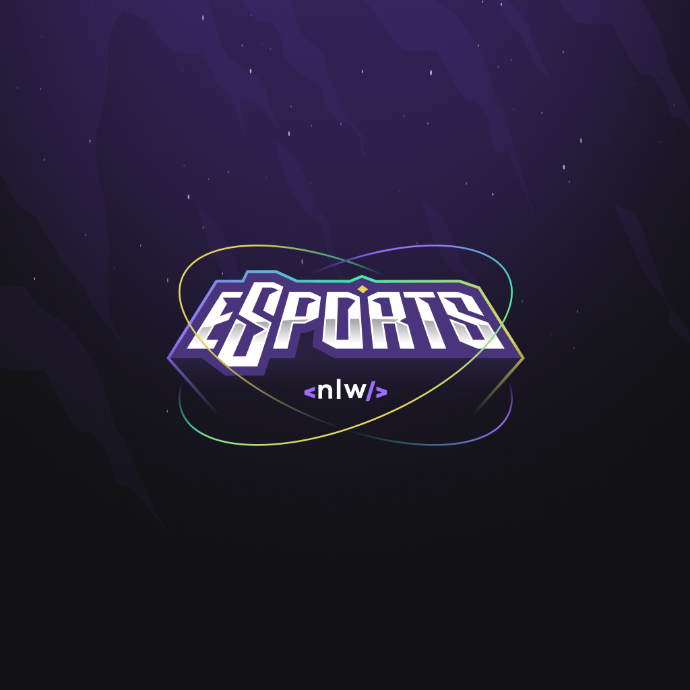
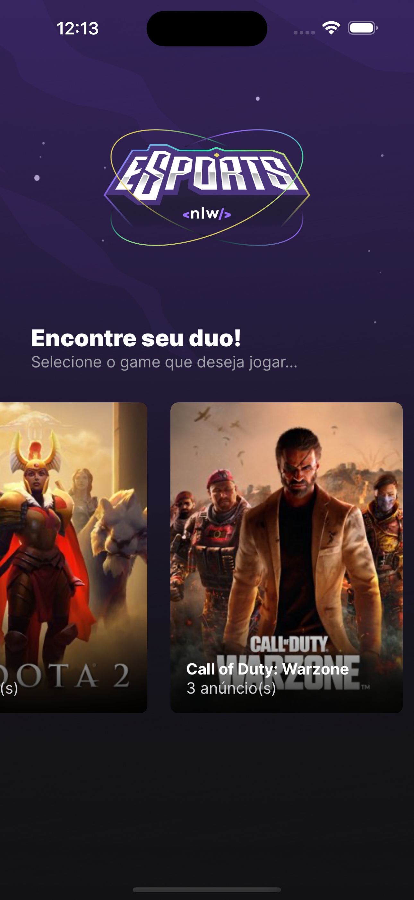
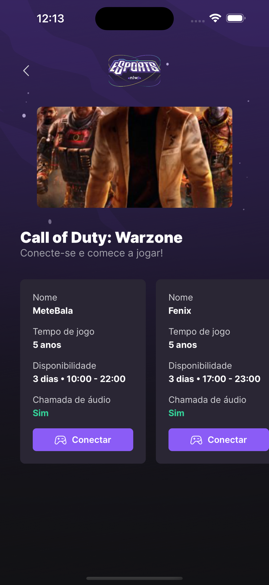

<div align="center" style="margin-bottom: 20px;">
  <h1>Mobile</h1>
  <p align="center">
    
    
    
  </p> 

  
</div>

### About project
This is the mobile app of the esports-duo project, we use technologies such as TypeScript and React Native as a development base, this app works for android and iOS and with the app we can locate players in games listing their ads to play.


### Main technologies
- [TypeScript](https://www.typescriptlang.org/docs/)
- [React Native](https://reactnative.dev/)
- [Expo](https://expo.dev/)


### Run this project
```bash
# clone this project
git clone https://github.com/jefferson1104/esports-duo.git

# access the project folder
$ cd esports-duo/mobile

# install dependencies
$ npm install

# run the project on the your smartphone or simulator
$ expo start

# if you are using physical phone android or ios, please install Expo Go app!
```

### Screenshots
<p align="center">
  
  
  
  
  
  
</p>


### Improvements
- finish the push notifications feature using expo-notifications, it remains to finish the mobile and implement the call in the backend.
- create login system using discord, twitch or JWT.
