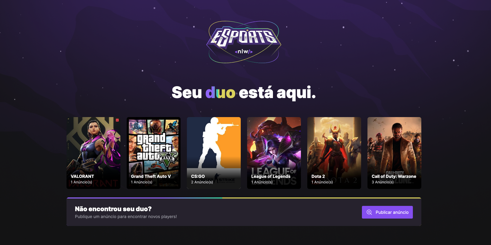

<div align="center" style="margin-bottom: 20px;">
  <h1>Web (front-end)</h1>
  <p align="center">
    
    
    
    
  </p> 

  
</div>


### About project
This is the front-end of the esports-duo project, we use technologies such as React.js and TypeScript as the basis of development, here it is possible to list the games and create ads to play with the guys.


### Main technologies
- [Vite](https://vitejs.dev/)
- [TypeScript](https://www.typescriptlang.org/docs/)
- [ReactJS](https://pt-br.reactjs.org/)
- [TailwindCSS](https://tailwindcss.com/)
- [Axios](https://axios-http.com/ptbr/docs/intro)


### Run this project
```bash
# clone this project
git clone https://github.com/jefferson1104/esports-duo.git

# access the project folder
$ cd esports-duo/web

# install dependencies
$ npm install

# run the project on the local machine
$ npm run dev
```

### Screenshots
<p align="center">
  
  
</p>


### Improvements
- Responsiveness
- Create carousel to list more than 6 games (use keen-slider)
- Make data validation (use react hook form with yup, zod, joi and etc...)
- Put authentication with Discord, Twitch or any JWT.
